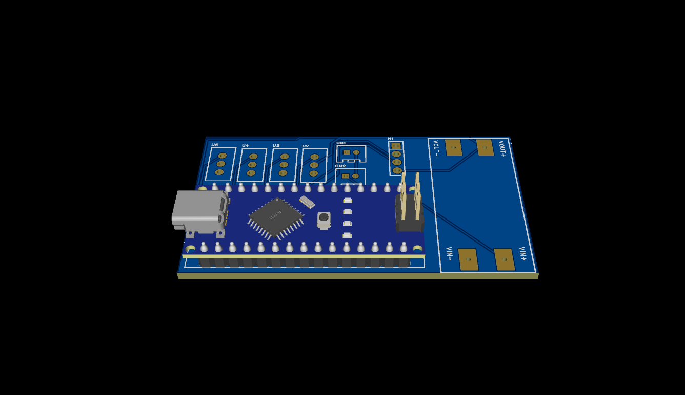

# 🐕 Robot Dog PCB Controller
A custom double-layer PCB shield for Arduino Nano to control a quadruped Robot Dog, featuring 4 servo ports and an ultrasonic sensor interface.

## 📌 Overview
This repository contains the hardware design files for a custom **Double Layer PCB** built to control a quadruped Robot Dog. The board acts as a compact, centralized shield for an **Arduino Nano**, streamlining power distribution and signal routing for servo motors and obstacle-avoidance sensors.

## ✨ Key Features
* **🧠 Microcontroller:** Designed specifically for the **Arduino Nano**.
* **🦾 Actuation:** 4 dedicated headers for standard Servo Motors.
* **👀 Perception:** Integrated port for an **HC-SR04 Ultrasonic Sensor** (distance measuring).
* **⚡ Power Management:** Features a footprint for an **MT3608 DC-DC Step-Up Boost Converter** module. This allows flexible, lower-voltage battery inputs to be stepped up to the required operating voltage, supported by dual 2-pin power terminals.
* **📏 Form Factor:** Clean, logical layout on a robust 2-layer board with wide tracks for power handling.

## 📦 Bill of Materials (BOM)
| Reference | Quantity | Component | Description |
| :--- | :---: | :--- | :--- |
| **U1** | 1 | Arduino Nano | Main Microcontroller |
| **U2, U3, U4, U5** | 4 | `1x3` Male/Female Headers | Servo Motor Connectors |
| **H1** | 1 | `1x4` Male Header | Ultrasonic Sensor (HC-SR04) Port |
| **YK1** | 1 | MT3608 Module | DC-DC Boost Converter Footprint |
| **CN1, CN2** | 2 | `2.0-2P` Terminals | Main Power Input / Output Connectors |

## 🔌 Pin Mapping Configuration
Based on the board layout, the components interface with the Arduino Nano via the following pins:
* **Servo Connectors (U2-U5):** Routed to PWM-capable digital pins (`D6`, `D9`, `D10`, `D11`).
* **Ultrasonic Sensor (H1):** Routed to digital pins (`D12`, `D13`).
* **Power:** VCC and GND planes are distributed safely across the bottom layer.

## 🛠️ Manufacturing & Assembly
1. **Fabrication:** Zip the Gerber files and upload them to your preferred PCB manufacturer (e.g., JLCPCB). 
2. **Soldering:** Solder the headers and terminals. It is highly recommended to use female headers for the Arduino Nano so it can be easily removed or replaced.
3. **Power Tuning (Crucial):** If using the MT3608 boost converter, use a multimeter to tune the output voltage (e.g., to exactly 5V) **before** plugging in the Arduino Nano and Servos to prevent overvoltage damage.

---
*Designed by Yazid*
